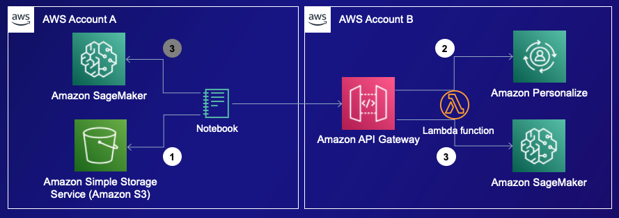

# Personalized Product Tag-Line & Poster Generation using Amazon SageMaker JumpStart and Amazon Personalize

## Objective

When users come across tagged or captioned content, these tags or captions are usually fixed and unchangeable from the perspective of the viewer. Consequently, users may disengage from the content if they find the tags or captions irrelevant or uninteresting.

This notebook demonstrates the process of integrating personalized product recommendations (from Amazon Personalize), user preference data, and product metadata into a unified prompt for an LLM (Large Language Model) with the objective of generating a personalized tagline for the product. This personalized tagline is tailored to increase the likelihood of user engagement. The practical application of this approach is showcased using retail products as examples.

## Architecture Diagram

1. Load data from Amazon S3.
2. Call an Amazon Personalize recommender (a managed endpoint) to get personalized recommendations. 
3. Call an Amazon SageMaker model endpoint via Amazon API Gateway and AWS Lambda. For more details, check the [blog](https://aws.amazon.com/blogs/machine-learning/call-an-amazon-sagemaker-model-endpoint-using-amazon-api-gateway-and-aws-lambda/), or a model deployed in the same AWS acccount as the Amazon SageMaker notebook.

## Key Technologies

- Amazon SageMaker JumpStart
  - Text-to-text model, e.g. [Falcon-40B-Instruct](https://huggingface.co/tiiuae/falcon-40b-instruct) 
  - Text-to-image model, e.g. [Stable Diffusion v2-1](https://huggingface.co/stabilityai/stable-diffusion-2-1-base)
- Amazon Personalize
  - Real time product recommendations

## Get Started

Go to [notebook](./personalized-tag-lines.ipynb) to gain your hands-on experience.

Note that the data we use for both users and products (located in `./data`) are all made up.

## Acknowledge

The initial version of the content is an AWS example crafted by talented AWS professionals, and we anticipate that it will be available on GitHub shortly.

